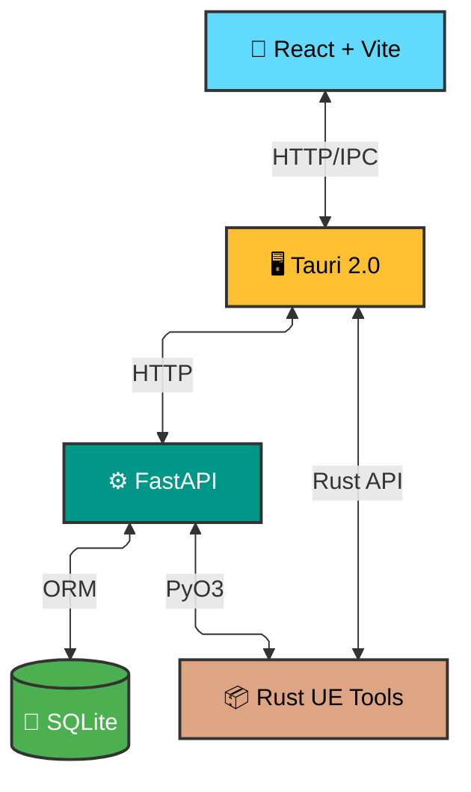

<div align="center">


# RivalNxt

### Marvel Rivals Mod Manager

_One desktop app to manage, activate, and validate Marvel Rivals mods with conflict detection, NexusMods integration, and blazing-fast local database._

[](#installation)
[](https://python.org)
[](https://reactjs.org)
[](https://rustlang.org)
[](https://tauri.app)

[Features](#-features) • [Installation](#-installation) • [Development Guide](#-development-guide) • [Contributing](#-contributing)

</div>

---

## ✨ Features

**🎯 Core Functionality**

- **Smart Mod Management** - Activate, deactivate, and organize mods with per-mod and bulk actions
- **Conflict Detection** - Automatic detection and resolution of mod conflicts with tag rebuilding
- **Auto-Detection** - Automatically detects Marvel Rivals installation path via Steam/Epic Games registry and archive tools (7-Zip/WinRAR)
- **One-Click Downloads** - Click "Download with Mod Manager" on NexusMods to instantly download and install mods
- **Background Processing** - Automatic download processing via NXM protocol without manual intervention

**🔧 Technical Highlights**

- **Local-First Database** - Portable SQLite with health checks and inspection utilities
- **Rust-Powered Core** - Native Rust `rust-ue-tools` library with PyO3 bindings via Maturin
- **Modern Tech Stack** - Tauri 2 desktop shell + React/Vite frontend + FastAPI/Python backend
- **CI/CD Automation** - GitHub Actions workflow for automated builds and releases
- **One-Click Build** - Complete build script for easy local development setup

**🌐 NexusMods Integration**

- **Browser Integration** - "Download with Mod Manager" button on NexusMods automatically opens RivalNxt
- **NXM Protocol** - Bi-directional handoff system with Windows registry integration
- **Background Processing** - Automatic download processing via `NxmBackgroundListener` component
- **API Integration** - Metadata fetching and update notifications
- **Test Functionality** - Built-in protocol validation tools

**⚡ Rust UE Tools Library**

- **PyO3 Integration** - Python bindings built with Maturin for seamless interop
- **Native Performance** - Rust library replaces slow Python/external tool processing
- **PAK/UTOC Support** - Direct unpacking and listing without external CLI dependencies
- **AES Encryption** - Built-in support for encrypted mod files
- **Batch Processing** - Parallel processing for multiple mod files
- **Archive Support** - Handles ZIP and RAR archives containing mod files

## 🚀 Installation

### 1. Download the Installer

- Go to the **Releases** page.
- Download the latest setup file, for example:
  **`RivalNxt_0.1.0_x64-setup.exe`** (or any newer version).

### 2. Install & Launch

- Run the installer.
- Launch the application after installation completes.

### 3. Configure Paths (Auto-Detection Available)

RivalNxt can **automatically detect** your Marvel Rivals installation if installed via Steam or Epic Games Store.

In **Settings**:
- **Marvel Rivals game directory** → Click "Auto-Detect" or manually select `marvel_rivals_root`
- **Local downloads directory** → Manually select `marvel_rivals_local_downloads_root`

> 💡 **Tip**: The app also auto-detects archive tools (7-Zip/WinRAR) for extracting mod files.

#### ⚠️ Mod Folder Naming Convention

Every mod inside your `marvel_rivals_local_downloads_root` directory must follow this format:

`<name>-<modid>-<version>`

Example: `CoolSkin-12345-1.0.0`

This helps the app detect and track mods accurately.

### 4. Nexus Personal API Key

To enable automatic mod detail fetching and update notifications:

1. Go to **[https://next.nexusmods.com/settings/api-keys](https://next.nexusmods.com/settings/api-keys)**
2. Scroll **all the way down**
3. Copy your **Personal API Key**
4. Paste it into the API key field in the app's Settings

### 5. You're Ready to Use the App

No Node.js, Rust, or Python is needed for normal usage.

### For Developers

See the [Development Guide](#-development-guide) below.

## 🏗️ Architecture



**Tech Stack**

- **Frontend**: React 18, TypeScript, Vite 6, Radix UI, Tailwind CSS
- **Backend**: Python 3.10+, FastAPI, Uvicorn, SQLAlchemy
- **Desktop**: Tauri 2.0 (Rust), Windows native
- **Rust UE Tools**: Native Rust library with dual interfaces (Rust API + PyO3 bindings via Maturin)
- **Database**: SQLite with optimized materialized views

## 🦀 Rust UE Tools Library

RivalNxt includes a high-performance native Rust library (`rust-ue-tools`) that provides programmatic access to Unreal Engine PAK and UTOC file operations, replacing external command-line tools like `repak` and `retoc_cli`.

### Key Features

- **✅ PAK File Support**: Unpack .pak files without external tools
- **✅ UTOC File Support**: List contents of .utoc files (UE5 IoStore format)
- **✅ AES Encryption**: Handle encrypted mod files with proper key management
- **✅ Compression Support**: Full support for Oodle, Zstd, Zlib, LZ4 compression
- **✅ Archive Processing**: Extract ZIP and RAR archives containing mod files
- **✅ Parallel Processing**: Leverage Rayon for concurrent file operations
- **✅ Python Bindings**: PyO3 integration for seamless Python usage

### Usage Examples

#### Basic Asset Path Extraction

```rust
use rust_ue_tools::Unpacker;

let unpacker = Unpacker::new();
let zip_path = "mod_file.zip";
let aes_key = Some("0C263D8C22DCB085894899C3A3796383E9BF9DE0CBFB08C9BF2DEF2E84F29D74");

match unpacker.extract_asset_paths_from_zip(zip_path, aes_key, false) {
    Ok(asset_paths) => {
        for asset in asset_paths {
            println!("Asset: {}", asset);
        }
    }
    Err(e) => {
        println!("Error: {}", e);
    }
}
```

#### PAK File Unpacking

```rust
use rust_ue_tools::{Unpacker, PakUnpackOptions};

let unpacker = Unpacker::new();
let options = PakUnpackOptions::new()
    .with_aes_key(aes_key.unwrap_or_default())
    .with_strip_prefix("../../../")
    .with_force(true)
    .with_quiet(false);

match unpacker.unpack_pak("mod.pak", "output_dir", &options) {
    Ok(asset_paths) => {
        println!("Unpacked {} files", asset_paths.len());
    }
    Err(e) => {
        println!("Error unpacking: {}", e);
    }
}
```

#### UTOC File Listing

```rust
use rust_ue_tools::{Unpacker, UtocListOptions};

let unpacker = Unpacker::new();
let options = UtocListOptions::new()
    .with_aes_key(aes_key.unwrap_or_default())
    .with_json_format(false);

match unpacker.list_utoc("mod.utoc", &options) {
    Ok(asset_paths) => {
        for asset in asset_paths {
            println!("Asset: {}", asset);
        }
    }
    Err(e) => {
        println!("Error listing: {}", e);
    }
}
```

### Migration from Python

The Rust library replaces the original Python `zip_to_asset_paths.py` script:

**Before (Python)**

```python
from core.assets.zip_to_asset_paths import extract_uasset_paths_from_zip

asset_paths = extract_uasset_paths_from_zip(
    "mod.zip",
    repak_bin="path/to/repak",
    aes_key="your-key"
)
```

**After (Rust)**

```rust
use rust_ue_tools::Unpacker;

let unpacker = Unpacker::new();
let asset_paths = unpacker.extract_asset_paths_from_zip(
    "mod.zip",
    Some("your-key"),
    false
)?;
```

### Building from Source

```bash
# Build with Maturin (recommended for PyO3 bindings)
cd src-tauri/src/rust-ue-tools
maturin build --release --features pyo3

# Install the built wheel
pip install target/wheels/*.whl

# Manual Rust build (library only)
cargo build --release --features pyo3

# Run tests
cargo test

# Build documentation
cargo doc --open
```

### Performance Benefits

- **🚀 10-50x Faster**: Native Rust vs Python subprocess calls
- **📦 No External Dependencies**: Eliminates repak.exe/retoc_cli.exe requirements
- **💾 Memory Efficient**: Streams data instead of loading entire files
- **🔄 Parallel Processing**: Rayon-powered concurrent operations
- **📊 Progress Tracking**: Built-in progress reporting for long operations
- **🐍 Python Integration**: Maturin-based PyO3 bindings for seamless Python usage

## 💻 Development Guide

### Prerequisites

- Windows 10/11 (for desktop builds)
- Node.js 18+ and npm
- [Rust toolchain](https://rustup.rs/) via rustup
- Python 3.10+
- [Maturin](https://www.maturin.rs/) for PyO3 builds: `pip install maturin`
- Git

### Quick Start (One-Click Build)

For new users, use the automated build script that handles everything:

```bash
# Clone repository with submodules
git clone --recurse-submodules https://github.com/Rounak77382/Project_ModManager_Rivals.git
cd Project_ModManager_Rivals

# Run one-click build (Windows)
.\build_local.bat

# This will:
# 1. Install npm dependencies
# 2. Build Rust UE Tools with PyO3 bindings
# 3. Create Python wrapper module
# 4. Build Python backend with PyInstaller
# 5. Build Tauri application
# 6. Generate NSIS installer
```

### Manual Development Setup

```bash
# 1. Clone repository with submodules
git clone --recurse-submodules https://github.com/Rounak77382/Project_ModManager_Rivals.git
cd Project_ModManager_Rivals

# If you already cloned without submodules:
git submodule update --init --recursive

# 2. Install frontend dependencies
npm install

# 3. Setup Python environment
python -m venv .venv
.venv\Scripts\Activate.ps1
pip install -r requirements.txt
pip install maturin  # For PyO3 builds

# 4. Build Rust UE Tools with Maturin
cd src-tauri/src/rust-ue-tools
maturin build --release --features pyo3
pip install target/wheels/*.whl
cd ../../..

# 5. Start development servers
# Terminal 1: Backend
python src-python/run_server.py

# Terminal 2: Frontend
npm run dev

# OR run full desktop app
npm run tauri:dev
```

### Build Commands

```bash
# One-click build (recommended)
.\build_local.bat

# Manual builds
npm run build          # Production web build
npm run tauri:build    # Full desktop application

# Rust UE Tools with Maturin
cd src-tauri/src/rust-ue-tools
maturin build --release --features pyo3
maturin develop  # Install in development mode
```

### Project Structure

```
📦 RivalNxt
├── 📁 core/                    # Python backend modules
│   ├── api/                   # FastAPI endpoints (50+)
│   ├── db/                    # SQLite + migrations
│   ├── ingestion/             # File scanning & discovery
│   ├── nexus/                 # NexusMods API client
│   └── utils/                 # Shared utilities
├── 📁 scripts/                # CLI automation (25+ tools)
├── 📁 src/                    # React frontend
│   ├── components/           # UI components
│   ├── lib/                  # API client & utils
│   └── styles/               # Tailwind CSS
├── 📁 src-tauri/             # Rust desktop shell
│   ├── src/rust-ue-tools/    # Native Rust library (Git submodule)
│   │   ├── repak-rivals/    # Workspace with PAK/UTOC/Oodle
│   │   ├── pyproject.toml   # Maturin build config
│   │   └── Cargo.toml       # Rust workspace config
│   └── src/main.rs           # Tauri main entry
├── 📁 build_local.bat        # One-click build script
├── 📁 .github/workflows/     # CI/CD automation
└── 📁 src-python/            # Backend entry point
```

### Development Workflow

**Code Standards**

- Python: PEP 8 with type hints
- TypeScript: Strict mode, React hooks patterns
- Rust: Standard conventions with `tauri-plugin-*`

#### Rust UE Tools Development

When working on the Rust components, ensure you have the latest Rust toolchain:

```bash
# Update Rust toolchain
rustup update stable

# Check toolchain version
rustc --version

# Run Rust-specific tests
cd src-tauri/src/rust-ue-tools
cargo test
cargo clippy  # Linting
cargo fmt --check  # Code formatting check
```

**Rust Development Tools:**

- **rust-analyzer** (VS Code extension) - IDE support
- **cargo-watch** - Auto-recompile on changes: `cargo install cargo-watch`
- **cargo-audit** - Security vulnerability checking: `cargo install cargo-audit`

**Useful Commands**

```
# Database inspection
python -X utf8 -m scripts.inspect_db

# Database rebuild
python -X utf8 -m scripts.rebuild_sqlite

# Check missing metadata
python -X utf8 -m scripts.report_missing_tags
```

**VS Code Extensions** (Recommended)

- Python (ms-python.python)
- Rust Analyzer (rust-lang.rust-analyzer)
- TypeScript (ms-vscode.vscode-typescript-next)
- Tailwind CSS (bradlc.vscode-tailwindcss)

## 🤖 CI/CD Automation

RivalNxt uses GitHub Actions for automated builds and releases.

### Release Workflow

When a new GitHub Release is published, the workflow automatically:

1. **Builds PyO3 Module** - Uses Maturin to build Python wheel with Rust bindings
2. **Packages Backend** - Creates standalone executable with PyInstaller
3. **Builds Tauri App** - Compiles desktop application with embedded backend
4. **Uploads Assets** - Attaches installer to the GitHub Release

### Workflow File

See [`.github/workflows/release.yml`](file:///c:/Users/rouna/OneDrive/Documents/vs_code_projects/RivalNxt/.github/workflows/release.yml) for the complete CI/CD configuration.

### Key Features

- **Submodule Support** - Automatically initializes Git submodules
- **Multi-stage Caching** - Caches Rust, Node, and Python dependencies
- **Size Validation** - Ensures backend executable includes all dependencies
- **Artifact Upload** - Uploads build artifacts for debugging
- **Automated Release** - No manual build steps required for releases

### Creating a Release

```bash
# 1. Tag your commit
git tag v0.2.0
git push origin v0.2.0

# 2. Create GitHub Release from tag
# The workflow will automatically build and attach the installer
```

## ⚙️ Configuration

Configuration is stored at: `%APPDATA%/com.rivalnxt.modmanager/settings.json`

**Environment Variables**

| Variable                             | Description             | Default           |
| ------------------------------------ | ----------------------- | ----------------- |
| `MM_DATA_DIR`                        | Data directory override | Platform-specific |
| `MM_BACKEND_HOST`                    | Backend bind address    | `127.0.0.1`       |
| `MM_BACKEND_PORT`                    | Backend port            | `8000`            |
| `NEXUS_API_KEY`                      | NexusMods API key       | None              |
| `MARVEL_RIVALS_ROOT`                 | Game installation path  | Required          |
| `MARVEL_RIVALS_LOCAL_DOWNLOADS_ROOT` | Mod downloads folder    | Required          |

See [Configuration Guide](./NEXUS_API_KEY_USAGE.md) for detailed setup instructions.

## 🤝 Contributing

We welcome contributions! Please see our [Contributing Guidelines](#contribution-guidelines) for details.

### Contribution Guidelines

**Getting Started**

1. Check [open issues](https://github.com/Rounak77382/Project_ModManager_Rivals/issues)
2. Look for [`good first issue`](https://github.com/Rounak77382/Project_ModManager_Rivals/labels/good%20first%20issue) labels
3. Open an issue for major changes before starting work

**Pull Request Process**

1. Fork the repository
2. Create a feature branch (`git checkout -b feature/AmazingFeature`)
3. Commit changes (`git commit -m 'Add AmazingFeature'`)
4. Push to branch (`git push origin feature/AmazingFeature`)
5. Open a Pull Request

**Code Quality Standards**

- Add tests for new features
- Update documentation
- Follow existing code style
- Validate all inputs and API parameters

## 🐛 Known Issues

See the [issue tracker](https://github.com/Rounak77382/Project_ModManager_Rivals/issues) for known bugs and feature requests.

## 📄 License

No license file is currently present. This project is "all rights reserved" by default. Please open an issue to discuss licensing before contributing or reusing code.

Consider adding an SPDX-compatible `LICENSE` file (MIT, Apache 2.0, GPL, etc.).

## 🙏 Acknowledgments

Built with amazing open-source tools:

- [Rust UE Tools](https://github.com/Rounak77382/rust-ue-tools) - Native Rust implementation replacing external CLI tools
  - Based on [natimerry/repak-rivals](https://github.com/natimerry/repak-rivals) and retoc libraries
  - Provides PAK/UTOC operations without external dependencies
- [Tauri](https://tauri.app/) - Lightweight desktop runtime
- [FastAPI](https://fastapi.tiangolo.com/) - Modern Python web framework
- [React](https://reactjs.org/) + [Vite](https://vitejs.dev/) - Fast frontend tooling
- [Radix UI](https://www.radix-ui.com/) - Accessible component primitives
- [NexusMods](https://www.nexusmods.com/) - Modding community platform

---

<div align="center">

Made with ❤️ for the Marvel Rivals modding community

**[⬆ back to top](#-rivalnxt)**

</div>
